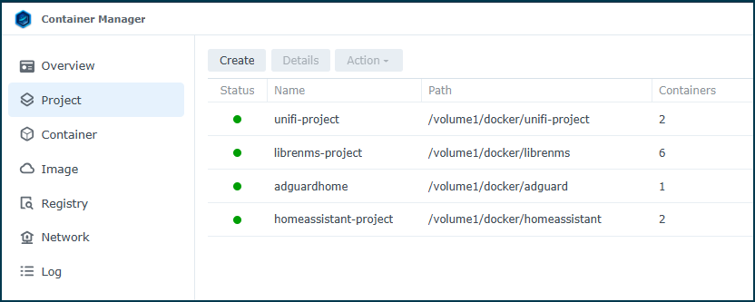
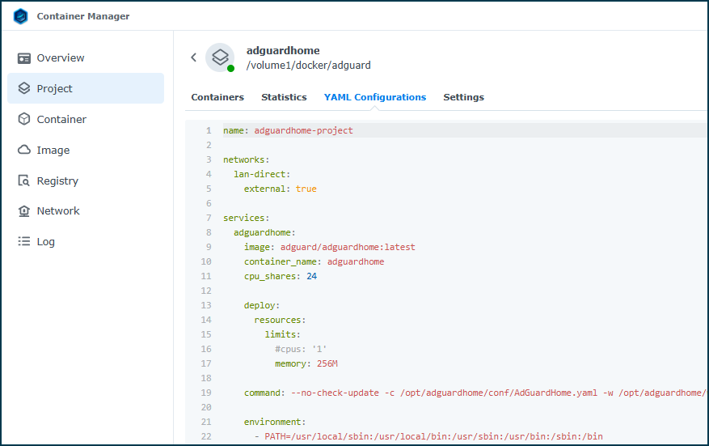
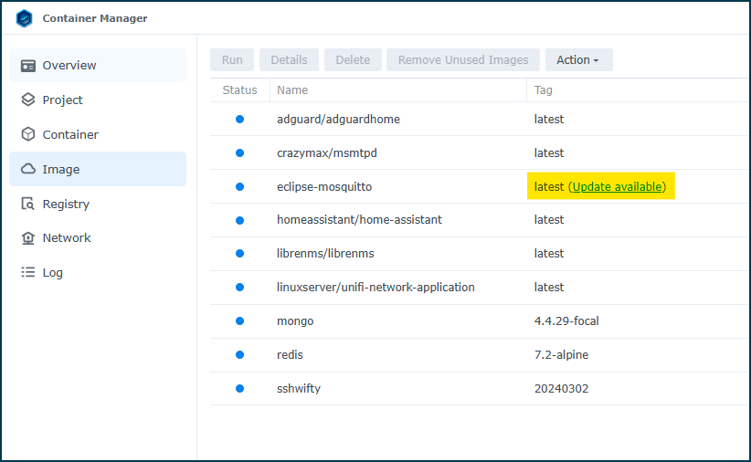
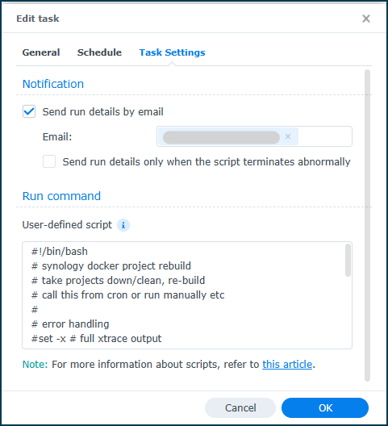
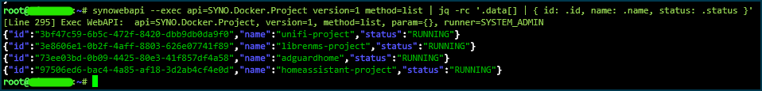
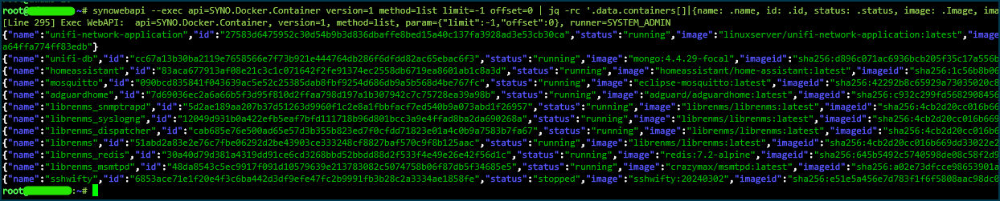
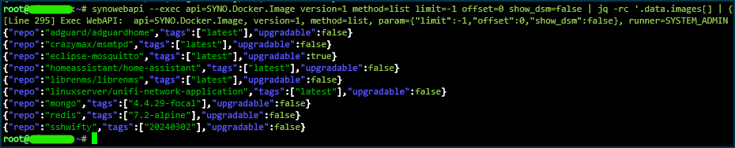

# synology-docker-project-automate
### Automating Synology Container Manager Projects

> These scripts are under development. If you accept the risk you can use the script to evaluate your results. Feedback is welcome.

>### Please read this entire doc for all details and warnings. Always make backups and test before putting custom scripts into production! 



## What this is for
Synology Container Manager (docker) "Projects" are used to maintain docker compose-like applications on the Synology diskstation platform. Projects use a yaml file (compose format) to define a collection of containers/volumes/networks. Projects work just like Portainer Stacks, using docker compose, and building a Project brings up all objects defined in the yaml.



When docker image maintainers update or release new versions in the docker repository, and you would like to update your containers to the new image, it requires a manual clean of the Project, a pull of the latest image (image update in the webui) and re-build of the Project. As far as I can tell there are no notifications for image updates, and no way to automatically get these pulled down within the Synology Container Manager.



This is an attempt at a hands-off method to handle rebuilding any running projects with the latest available image.

## How it works

As luck would have it Synology uses an API to handle the administration of most tasks on a diskstation. We can utilize the `synowebapi` binary utility on the local Synology system to feed requests to the Synology API.

The **SYNO.Docker.Project** API namespace allows us to start(up) and stop(down) Projects as well as clean (container/volume/network removal) and build (container/volume/network creation) Projects from the defined Project yaml file.

We use a simple bash script and the Synology API to perform actions on the Synology Container Manager Projects available on the target Synology system.

1. Call the API to get a list of Projects in the "RUNNING" state
2. Iterate through the list of Projects, obtain the id of each Project and 
    - execute the 'clean_stream' method to bring the Project down
    - execute the 'prune' method to remove unused images
    - execute the 'build_stream' method to pull images and bring the Project back up
3. Logs each action to the system log

# WARNING - WARNING - WARNING

>I am NOT chekcing to see if an image is upgradable before removing the image! This means we are removing and re-pulling images every time, regardless of their current status in the docker repo - ***and regardless if they even exist anymore***! This means you might remove your containers and images completely and never get them back! 

*You could in theory use the API to iterate through the Project > Containers > Images to see if they are upgradeable before cleaning them and rebuilding, and I might investigate this in future updates.*

### ***Why not use portainer/watchtower/diun/whatsupdocker/dockcheck/etc ?***

Native docker management/update tools engage directly with dockerd to manage compose, containers, images, volumes etc.

Synology wraps dockerd in their Container Manager and includes a Projects module that stores the compose yaml as well as container/image/volume state and integrates with the Synology application portal (reverse proxy) to allow you to publish docker entrypoints on the synology web front end (Web Station).

This means that if you use ''#>docker compose '' commands on a Synology Diskstation, the docker container, volumes, network WILL build/start/run fine, but the "Projects" module will not be aware, and the Web Station portal may not be aware of the docker applications and/or map/connect the ports required.

## Use this tool
*script is under development. run at your own risk.*

### Run manually

If you just want to test the script, or need to debug, use this option.

1. Upload the script to the device using file transfer tool or curl
    ```
    cd ~

    curl -LO https://raw.githubusercontent.com/rjadams82/synology-docker-project-automate/refs/heads/main/project-rebuild.sh
    ```
2. make the script executable
3. run the script with sudo

    ```
    chmod 744 project-rebuild.sh
    sudo ./project-rebuild.sh
    ```


### Run on a schedule

The intended (easiest) way to use this tool is to create a scheduled task in DSM Control Panel, set the schedule to something appropriate (monthly/weekly/daily), choosing a time that is least impactful and paste the entire script contents into the task settings. The task needs to be run as the root user, or the API calls may fail.

>
>

## Troubleshooting

### Check logs

Use the systemd journal command to inspect the log entries from this script.  
`sudo journalctl -t docker-project-rebuild` 

>You will need to do this with sudo, journal does not seem to show system log from a standard user account. The journal does rotate frequently so you may not catch all entries. 

**More logging options:**
- If you run the script manually by calling it in the shell, you should see all output from STDIN direclty in the shell terminal.

- If you run the script from a task, and enable "Send run details by email" you should get the full script output in an email for review once the task finishes.

- If you enable "Save output results" in your DSM Task Scheduler you will have logfiles generated on your system that you can manually review.

### Manual API Calls

If you are not getting the expected results you can always make manual API calls to see what the output is. Synology API seems RESTful and there are some KB explaining how to use. See:

https://kb.synology.com/en-us/DG/DSM_Login_Web_API_Guide/1

However they don't seem to publish the Container Manager API information. So I have noted some common API syntax for Container Manager (scratch.sh) or you can use the DSM WebUI in your favorite browser and inspect the calls when you click buttons in the WebUI to see what the browser is sending back to DSM.

Now, the KB above and your browser debug is using web API calls to `synology_device/webapi/entry.cgi`. But in this script I am interacting with the API ***locally*** from the Synology system shell using the `synowebapi` utility, which does not require authentication and uses [command][argument] syntax so keep that in mind when debugging.

The API does return results in JSON format so I make use of the handy `jq` command to parse the results. Besides making JSON readable you can filter and format the output as needed.

#### Some common commands:

*List all projects*
```
synowebapi --exec api=SYNO.Docker.Project version=1 method=list | jq -rc '.data[] | { id: .id, name: .name, status: .status }'
```


*List all containers*
```
synowebapi --exec api=SYNO.Docker.Container version=1 method=list limit=-1 offset=0 | jq -rc '.data.containers[]|{name: .name, id: .id, status: .status, image: .Image, imageid: .ImageID}'
```


*List all images*
```
synowebapi --exec api=SYNO.Docker.Image version=1 method=list limit=-1 offset=0 show_dsm=false | jq -rc '.data.images[] | { repo: .repository, tags: .tags, upgradable: .upgradable}'
```
